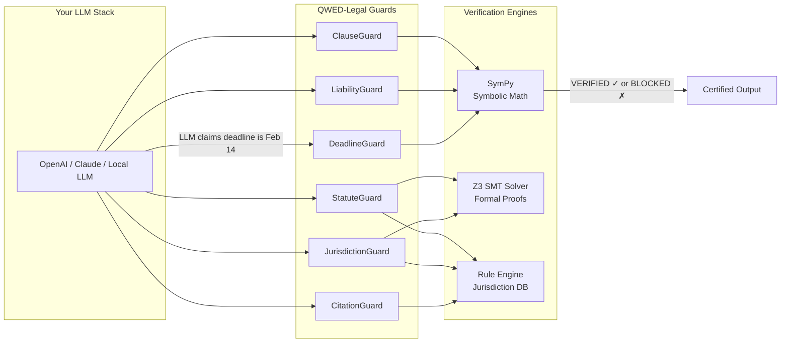

<div align="center">
  <h1>🏛️ QWED-Legal</h1>
  <h3>Verification Guards for Legal Contracts</h3>
  
  > **Catch AI hallucinations before they become lawsuits.**
  
  <p>
    <b>Don't trust AI with legal analysis. Verify it.</b><br>
    <i>Deadline math • Clause contradictions • Liability calculations</i>
  </p>

  [](https://github.com/QWED-AI/qwed-legal)
  [](https://docs.qwedai.com/docs/engines/overview#deterministic-first-philosophy)
  [](https://github.com/QWED-AI)
  [](https://pypi.org/project/qwed-legal/)
  [](https://www.npmjs.com/package/@qwed-ai/legal)
  [](LICENSE)
  [](https://www.python.org/)
  [](https://github.com/QWED-AI/qwed-legal/actions)

</div>

---

## 🚨 The Problem

**Lawyers are using AI to review contracts. AI makes mistakes.**

| Case | What Happened | Impact |
|------|--------------|--------|
| **Mata v. Avianca (2023)** | ChatGPT cited 6 fake legal cases | $5,000 fine, sanctions |
| **Contract Review Errors** | LLMs miss contradictory clauses | Disputes, litigation |
| **Date Calculation Bugs** | "30 business days" miscalculated | Missed deadlines, defaults |

---

## 💡 What QWED-Legal Is (and Isn't)

### ✅ QWED-Legal IS:
- **Verification middleware** that checks LLM outputs for correctness
- **Deterministic** — uses symbolic math (SymPy) and formal proofs (Z3 SMT Solver)
- **Open source** — integrate into any workflow, no vendor lock-in
- **A safety layer** — catches mistakes before they cause real harm

### ❌ QWED-Legal is NOT:
- ~~A document drafting tool~~ — use Harvey, ChatGPT, or Claude for that
- ~~A contract review platform~~ — use LegalFly or Luminance for that  
- ~~A legal research assistant~~ — use Westlaw or LexisNexis for that
- ~~A replacement for lawyers~~ — we just help them catch AI mistakes

> **Think of QWED-Legal as the spell-checker for AI-generated legal claims.**
> 
> Harvey drafts. LegalFly reviews. Luminance classifies. **QWED verifies.**

---

## 🆚 How We're Different

| Aspect | Harvey / LegalFly / Luminance | QWED-Legal |
|--------|-------------------------------|------------|
| **Approach** | Probabilistic LLM generation | Deterministic symbolic verification |
| **Output** | "The deadline is likely March 15th" | `VERIFIED: March 15, 2024 ✓` (with proof) |
| **Accuracy** | ~95% (hallucination risk) | 100% mathematical certainty |
| **Tech** | GPT-4, Claude, custom LLMs | SymPy + Z3 SMT Solver |
| **Model** | Closed SaaS platform | Open-source SDK |
| **Pricing** | $1000s/month enterprise | Free (MIT License) |

### Use Together (Best Practice)
```
┌──────────────┐     ┌─────────────┐     ┌──────────────┐
│   Harvey AI  │ ──► │ QWED-Legal  │ ──► │   Verified   │
│  (generates) │     │  (verifies) │     │   Output     │
└──────────────┘     └─────────────┘     └──────────────┘
```

---

## ⚡ Quick Start

### 📦 Installation

| Language | Package | Command |
|----------|---------|---------|
| **Python** | `qwed-legal` | `pip install qwed-legal` |
| **TypeScript/JS** | `@qwed-ai/legal` | `npm install @qwed-ai/legal` |

**Python:**
```bash
pip install qwed-legal
```

**TypeScript/JavaScript:**
```bash
npm install @qwed-ai/legal
```

### Verify a Deadline Calculation

```python
from qwed_legal import DeadlineGuard

guard = DeadlineGuard()
result = guard.verify(
    signing_date="2026-01-15",
    term="30 business days",
    claimed_deadline="2026-02-14"  # LLM claimed this
)

print(result.verified)   # False!
print(result.computed_deadline)  # 2026-02-27 (correct)
print(result.message)
# ❌ ERROR: Deadline mismatch. Expected 2026-02-27, but LLM claimed 2026-02-14.
```

### Verify a Liability Cap

```python
from qwed_legal import LiabilityGuard

guard = LiabilityGuard()
result = guard.verify_cap(
    contract_value=5_000_000,
    cap_percentage=200,
    claimed_cap=15_000_000  # LLM said 15M
)

print(result.verified)  # False!
print(result.computed_cap)  # 10,000,000 (200% of 5M)
# ❌ ERROR: 200% of $5M = $10M, not $15M
```

### Detect Contradictory Clauses (Z3 Logic)

```python
from qwed_legal import ContradictionGuard, Clause

guard = ContradictionGuard()
result = guard.verify_consistency([
    Clause(id="1", text="Liability capped at $10k", category="LIABILITY", value=10000),
    Clause(id="2", text="Minimum penalty is $50k", category="LIABILITY", value=50000)
])

print(result["verified"])  # False!
print(result["message"])   
# ❌ LOGIC CONTRADICTION: Clauses are mutually exclusive. (50k > 10k Cap)
```

---

## 🛡️ The Six Guards

| Guard | What It Verifies |
|-------|------------------|
| **DeadlineGuard** | Date calculations, business days, leap years |
| **LiabilityGuard** | Cap percentages, tiered liability, indemnity limits |
| **ClauseGuard** | Clause contradictions, termination conflicts |
| **CitationGuard** | Legal citations (Bluebook format, case names, reporters) |
| **JurisdictionGuard** | Choice of law, forum selection, cross-border conflicts |
| **StatuteOfLimitationsGuard** | Claim periods by jurisdiction and claim type |

### Verify Legal Citations

```python
from qwed_legal import CitationGuard

guard = CitationGuard()
result = guard.verify("Brown v. Board of Education, 347 U.S. 483 (1954)")

print(result.valid)  # True
print(result.parsed_components)
# {'plaintiff': 'Brown', 'defendant': 'Board of Education', 'volume': 347, 'reporter': 'U.S.', 'page': 483, 'year': 1954}
```

## 🛡️ The QWED Legal Triangle

Based on the latest research in Legal AI Evaluation (Hu et al., 2025; Yu et al., 2025), QWED ensures coverage across the three critical dimensions of legal trust:

1.  **Output Accuracy (The "What"):**
    *   *Verified by:* `DeadlineGuard`, `LiabilityGuard`.
    *   *Role:* Ensures specific facts (dates, amounts) are mathematically correct.

2.  **Reasoning Quality (The "How"):**
    *   *Verified by:* `IRACGuard` [NEW].
    *   *Role:* Enforces "Reasoned Elaboration" [Source: MSLR Benchmark]. Ensures the AI doesn't hallucinate a correct answer via incorrect logic.

3.  **Trustworthiness (The "Source"):**
    *   *Verified by:* `SACChunker` (in Core).
    *   *Role:* Prevents "Retrieval Mismatch" where AI cites the wrong contract [Source: Reliable Retrieval in RAG].

## 📦 Components

### Verify Jurisdiction (New in v0.2.0!)

```python
from qwed_legal import JurisdictionGuard

guard = JurisdictionGuard()
result = guard.verify_choice_of_law(
    parties_countries=["US", "UK"],
    governing_law="Delaware",
    forum="London"
)

print(result.conflicts)  # ['Governing law Delaware (US state) but forum London is non-US...']
```

### Check Statute of Limitations (New in v0.2.0!)

```python
from qwed_legal import StatuteOfLimitationsGuard

guard = StatuteOfLimitationsGuard()
result = guard.verify(
    claim_type="breach_of_contract",
    jurisdiction="California",
    incident_date="2020-01-15",
    filing_date="2026-06-01"
)

print(result.verified)  # False - 4 year limit exceeded!
print(result.message)   # ❌ EXPIRED: Statute of limitations expired...
```

---

## 📦 TypeScript/JavaScript (npm)

```bash
npm install @qwed-ai/legal
```

### Available Verifiers

| Verifier | Description |
|----------|-------------|
| `DeadlineVerifier` | Verify date calculations |
| `LiabilityVerifier` | Verify liability caps |
| `ClauseVerifier` | Detect contradictions |
| `CitationVerifier` | Validate legal citations |
| `JurisdictionVerifier` | Check choice of law |
| `StatuteVerifier` | Check limitation periods |
| `LegalGuard` | All-in-one wrapper |

### TypeScript Examples

```typescript
import { 
  DeadlineVerifier, 
  JurisdictionVerifier, 
  StatuteVerifier,
  LegalGuard 
} from '@qwed-ai/legal';

// Verify deadline
const deadline = new DeadlineVerifier();
const result = await deadline.verify("2026-01-15", "30 days", "2026-02-14");
console.log(result.verified);  // true

// Check jurisdiction
const jurisdiction = new JurisdictionVerifier();
const jResult = await jurisdiction.verifyChoiceOfLaw(
  ["US", "UK"], "Delaware", "London"
);
console.log(jResult.conflicts);  // Array of conflicts

// All-in-one guard
const guard = new LegalGuard();
const deadline2 = await guard.deadline.verify(...);
const statute = await guard.statute.verify(...);
```

---

## 🌍 Supported Jurisdictions

### Statute of Limitations

| Jurisdiction | Breach of Contract | Negligence | Fraud |
|--------------|-------------------|------------|-------|
| California | 4 years | 2 years | 3 years |
| New York | 6 years | 3 years | 6 years |
| Texas | 4 years | 2 years | 4 years |
| Delaware | 3 years | 2 years | 3 years |
| UK/England | 6 years | 6 years | 6 years |
| Germany | 3 years | 3 years | 10 years |
| France | 5 years | 5 years | 5 years |
| Australia | 6 years | 6 years | 6 years |
| India | 3 years | 3 years | 3 years |

### DeadlineGuard Holiday Support

| Region | Countries/States |
|--------|-----------------|
| **United States** | All 50 states + DC |
| **European Union** | DE, FR, IT, ES, NL, BE, AT, PL |
| **Commonwealth** | UK, AU (all states), CA |
| **Asia** | IN (all states), SG, HK |


---

## 📊 Audit Log: Real Hallucinations Caught

| Contract Input | LLM Claim | QWED Verdict |
|----------------|-----------|--------------|
| "Net 30 Business Days from Dec 20" | Jan 19 | 🛑 **BLOCKED** (Actual: Feb 2, 2026) |
| "Liability Cap: 2x Fees ($50k)" | $200,000 | 🛑 **BLOCKED** (Actual: $100,000) |
| "Seller may terminate with 30 days notice" + "Neither party may terminate before 90 days" | "Clauses are consistent" | 🛑 **BLOCKED** (Conflict detected) |
| "Smith v. Jones, 999 FAKE 123" | Valid citation | 🛑 **BLOCKED** (Unknown reporter) |

---

## 🏦 All-in-One Guard

```python
from qwed_legal import LegalGuard

guard = LegalGuard()

# All verification methods in one object
guard.verify_deadline(...)
guard.verify_liability_cap(...)
guard.check_clause_consistency(...)
```

---

## 🌍 Jurisdiction Support

DeadlineGuard supports jurisdiction-specific holidays:

```python
from qwed_legal import DeadlineGuard

# US holidays (default)
us_guard = DeadlineGuard(country="US")

# UK holidays
uk_guard = DeadlineGuard(country="GB")

# California-specific holidays
ca_guard = DeadlineGuard(country="US", state="CA")
```

---

## 🔒 Security & Privacy

> **Your data never leaves your machine.**

| Concern | QWED-Legal Approach |
|---------|---------------------|
| **Data Transmission** | ❌ No API calls, no cloud processing |
| **Storage** | ❌ Nothing stored, pure computation |
| **Dependencies** | ✅ Local-only (SymPy, Z3, holidays) |
| **Audit Trail** | ✅ All verification results are deterministic and reproducible |

**Perfect for**:
- Law firms with strict confidentiality requirements
- Contracts containing trade secrets
- GDPR/HIPAA-sensitive documents
- Air-gapped environments

> 📖 **See [Determinism Guarantee](https://docs.qwedai.com/docs/engines/overview#deterministic-first-philosophy)** for how QWED ensures 100% reproducible verification.

---

## 🏗️ Architecture



**Key**: LLM output → QWED Guard → Symbolic Engine → Verified/Blocked

---

## 🔌 LLM Integration Examples

### With OpenAI

```python
from openai import OpenAI
from qwed_legal import DeadlineGuard, LiabilityGuard

client = OpenAI()
guard = DeadlineGuard()

def verified_legal_response(prompt: str) -> dict:
    # Step 1: Get LLM response
    response = client.chat.completions.create(
        model="gpt-4",
        messages=[{"role": "user", "content": prompt}]
    )
    llm_answer = response.choices[0].message.content
    
    # Step 2: Extract and verify claims
    # (In production, parse the LLM response for dates/amounts)
    verification = guard.verify(
        signing_date="2026-01-15",
        term="30 business days",
        claimed_deadline=llm_answer  # e.g., "2026-02-14"
    )
    
    # Step 3: Return verified or blocked
    return {
        "llm_response": llm_answer,
        "verified": verification.verified,
        "qwed_message": verification.message
    }
```

### With LangChain

```python
from langchain.tools import Tool
from qwed_legal import LegalGuard

guard = LegalGuard()

qwed_deadline_tool = Tool(
    name="verify_deadline",
    description="Verify a deadline calculation is correct",
    func=lambda x: guard.verify_deadline(**x)
)

qwed_liability_tool = Tool(
    name="verify_liability",
    description="Verify a liability cap calculation",
    func=lambda x: guard.verify_liability_cap(**x)
)

# Add to your LangChain agent
tools = [qwed_deadline_tool, qwed_liability_tool]
```

### As a CI/CD Check

```yaml
# .github/workflows/contract-verify.yml
name: Verify Contract Claims
on: [push]

jobs:
  verify:
    runs-on: ubuntu-latest
    steps:
      - uses: actions/checkout@v4
      - uses: QWED-AI/qwed-legal@v1
        with:
          contracts-path: './contracts/'
          fail-on-unverified: true
```

---

## ❓ FAQ

<details>
<summary><b>Is QWED-Legal free?</b></summary>

Yes! QWED-Legal is open source under the Apache 2.0 license. Use it in commercial projects, modify it, distribute it - no restrictions.
</details>

<details>
<summary><b>Does it call any external APIs?</b></summary>

No. All verification happens locally on your machine using SymPy and Z3. Your contract data never leaves your environment.
</details>

<details>
<summary><b>How accurate is it?</b></summary>

100% for supported verification types. Unlike LLMs that give probabilistic answers, QWED uses symbolic mathematics. `2 + 2 = 4` is deterministically true, and so are our deadline calculations.
</details>

<details>
<summary><b>Can it replace my legal AI tool?</b></summary>

No - and that's by design. QWED-Legal is a **verification layer**, not a replacement. Use Harvey/ChatGPT/Claude to draft, use QWED to verify their output.
</details>

<details>
<summary><b>What happens when verification fails?</b></summary>

You get a detailed result showing:
- ❌ What the LLM claimed
- ✅ What the correct answer is
- 📝 Why they differ (e.g., "Feb 17 is a holiday")
</details>

<details>
<summary><b>How fast is verification?</b></summary>

Typically <10ms per verification. The symbolic math engine is highly optimized.
</details>

---

## 🗺️ Roadmap

### ✅ Released (v0.2.0)
- [x] DeadlineGuard with business day calculations
- [x] LiabilityGuard for cap verification
- [x] ClauseGuard for contradiction detection
- **Reasoning Verification**: `IRACGuard` ensures legal reasoning follows Issue-Rule-Application-Conclusion structure.
- **Authority Verification**: `CitationGuard` (v0.2.0) checks for hallucinated case citations.

## 🌍 Global Jurisdiction Support (v0.2.0)
QWED-Legal now supports cross-border verification:
*   **JurisdictionGuard:** Detects conflicts between Governing Law and Forum Selection (e.g., Civil vs. Common Law mismatches).
*   **StatuteOfLimitationsGuard:** Deterministically calculates filing deadlines for CA, NY, TX, UK, and more.
*   **Attestation:** Every verification can be cryptographically signed (JWT) to provide an audit trail of safety checks.

## 📦 Installation
- [x] JurisdictionGuard for choice of law verification
- [x] StatuteOfLimitationsGuard for claim periods
- [x] TypeScript/npm SDK (@qwed-ai/legal)

### 🚧 In Progress
- [ ] IPClauseGuard - Intellectual property ownership verification
- [ ] IndemnityGuard - Indemnification scope analysis
- [ ] More jurisdictions (Canada, Latin America, MENA)

### 🔮 Planned
- [ ] ForceMAJEureGuard - Force majeure clause completeness
- [ ] NonCompeteGuard - Non-compete enforceability rules
- [ ] Full contract logic verification (Z3 first-order logic)
- [ ] VS Code extension for real-time verification
- [ ] LangChain/LlamaIndex native integration

---

## 🔗 Related QWED Packages

| Package | Purpose |
|---------|---------|
| [qwed-verification](https://github.com/QWED-AI/qwed-verification) | Core verification engine |
| [qwed-finance](https://github.com/QWED-AI/qwed-finance) | Banking & financial verification |
| [qwed-ucp](https://github.com/QWED-AI/qwed-ucp) | E-commerce transaction verification |
| [qwed-mcp](https://github.com/QWED-AI/qwed-mcp) | Claude Desktop integration |

---

## 📄 License

Apache 2.0 - See [LICENSE](LICENSE)

---

<div align="center">
  <b>⭐ Star us if you believe AI needs verification in legal domains</b>
  <br><br>
  <i>"In law, precision isn't optional. QWED makes it verifiable."</i>
</div>
