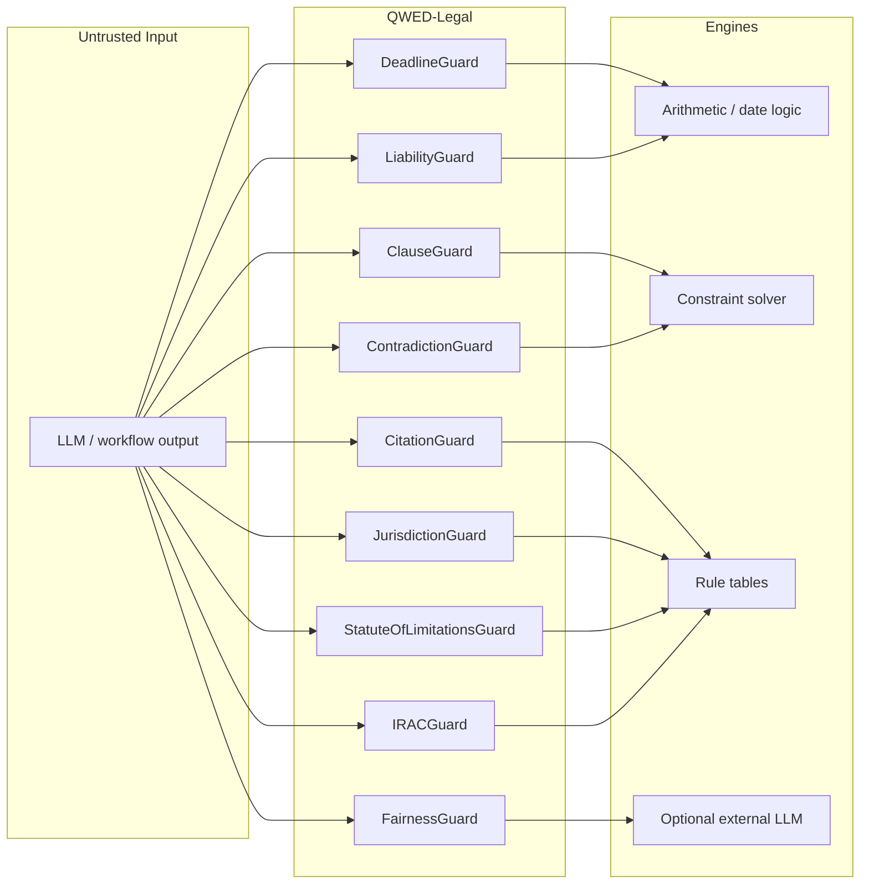

<div align="center">
  
  <h1>QWED-Legal</h1>
  <h3>Deterministic Verification Guards for Computational Legal Claims</h3>

  > **Block unproven legal claims before they become liabilities.**

  <p>
    <b>QWED-Legal verifies only what can be deterministically proven.</b><br>
    <i>Dates, amounts, structured constraints</i>
  </p>

  <p>
    QWED-Legal verifies ONLY what can be deterministically proven (dates, amounts, constraints).<br>
    Interpretive legal reasoning is NOT automatically trusted.
  </p>

  [](https://github.com/QWED-AI/qwed-legal)
  [](https://docs.qwedai.com/docs/engines/overview#deterministic-first-philosophy)
  [](https://github.com/QWED-AI)
  [](https://pypi.org/project/qwed-legal/)
  [](https://www.npmjs.com/package/@qwed-ai/legal)
  [](LICENSE)
  [](https://www.python.org/)
  [](https://github.com/QWED-AI/qwed-legal/actions)
</div>

---

## The Problem

LLMs can produce legal-sounding output that is wrong, incomplete, or unprovable.

| Failure mode | Example | Risk |
|--------------|---------|------|
| Fabricated authority | AI cites a nonexistent or malformed legal source | Sanctions, bad filings, bad advice |
| Deadline mistakes | "30 business days" is miscomputed | Missed obligations, defaults |
| Clause inconsistency | Two provisions cannot both be true | Disputes, unenforceable terms |
| False certainty | Model states a legal conclusion without proof | Liability, audit failure |

QWED-Legal is designed to sit between untrusted model output and downstream action.

---

## What QWED-Legal Is

QWED-Legal is a verification layer for **deterministic, computational legal claims**.

It is built to:

- verify only deterministic, provable components such as dates, calculations, and structured constraints
- reject or mark unverified claims that cannot be safely proven
- operate as a fail-closed middleware layer in legal AI workflows
- integrate into existing LLM, review, or contract-analysis pipelines

## Verification Boundaries

QWED-Legal operates under strict limits:

- only deterministic claims can be verified
- ambiguous or interpretive outputs are rejected or marked unverified
- legal reasoning is **not** assumed correct without proof
- if something cannot be proven, it must not pass

This repository should be understood as a **deterministic rejection layer**, not a general-purpose legal reasoning engine.

## ❌ What QWED-Legal Is Not

QWED-Legal is **not**:

- a legal reasoning engine
- a source of legal truth
- a replacement for lawyers
- a contract drafting tool
- a legal research assistant
- a guarantee that every legal output can be verified
- a system that can prove subjective, ambiguous, or interpretive legal conclusions

QWED-Legal is a rejection layer. It blocks what cannot be proven.

---

## Positioning

QWED-Legal is not another end-to-end legal AI assistant.

It does **not** compete by generating more legal text. It is intended to check narrow classes of legal claims that can be computed or constrained deterministically.

| Aspect | Generative legal tools | QWED-Legal |
|--------|-------------------------|------------|
| Primary role | Draft, summarize, classify, or answer | Verify narrow deterministic claims |
| Approach | Probabilistic generation | Deterministic checks where possible |
| Scope | Broad legal text tasks | Limited (computational checks only) |
| Output style | Plausible legal answer | Verified / blocked / unverified result |
| Certainty | Model confidence | 100% certainty only for supported deterministic checks |
| Failure mode | Can hallucinate or overstate | Should fail closed when proof is unavailable |
| Deployment | Often SaaS or model-centric | SDK / middleware / local verification layer |

### Recommended usage

```text
LLM or legal workflow -> QWED-Legal -> accept only what survives verification
```

---

## Quick Start

### Installation

| Language | Package | Command |
|----------|---------|---------|
| Python | `qwed-legal` | `pip install qwed-legal` |
| TypeScript / JS | `@qwed-ai/legal` | `npm install @qwed-ai/legal` |

```bash
pip install qwed-legal
```

```bash
npm install @qwed-ai/legal
```

### Verify a structured deadline claim

Use deterministic checks only with structured, unambiguous inputs.

```python
from qwed_legal import DeadlineGuard

guard = DeadlineGuard()
result = guard.verify(
    signing_date="2026-01-15",
    term="30 business days",
    claimed_deadline="2026-02-14"
)

print(result.verified)
print(result.computed_deadline)
print(result.message)
```

### Verify a liability cap calculation

```python
from qwed_legal import LiabilityGuard

guard = LiabilityGuard()
result = guard.verify_cap(
    contract_value=5_000_000,
    cap_percentage=200,
    claimed_cap=15_000_000
)

print(result.verified)
print(result.computed_cap)
print(result.message)
```

### Check a structured contradiction scenario

```python
from qwed_legal import ContradictionGuard, Clause

guard = ContradictionGuard()
result = guard.verify_consistency([
    Clause(id="1", text="Liability capped at $10k", category="LIABILITY", value=10000),
    Clause(id="2", text="Minimum penalty is $50k", category="LIABILITY", value=50000),
])

print(result["verified"])
print(result["message"])
```

---

## Guard Coverage

⚠️ Not all guards provide full formal verification.  
Some operate on partial rules or structured validation and should **not** be treated as complete legal proof.

| Guard | Status | What it checks |
|-------|--------|----------------|
| `DeadlineGuard` | `DETERMINISTIC` | Date arithmetic, business-day calculations, holiday-aware computations for supported inputs |
| `LiabilityGuard` | `DETERMINISTIC` | Cap calculations, tiered amount computations for supported numeric inputs |
| `ClauseGuard` | `PARTIAL / HEURISTIC` | Limited clause consistency and contradiction checks |
| `CitationGuard` | `PARTIAL / HEURISTIC` | Citation shape / format validation, not authoritative existence proof |
| `JurisdictionGuard` | `PARTIAL / HEURISTIC` | Structured checks around governing law / forum combinations |
| `StatuteOfLimitationsGuard` | `PARTIAL / HEURISTIC` | Limitation-period calculations for supported jurisdictions and claim types |
| `IRACGuard` | `PARTIAL / HEURISTIC` | IRAC structure and consistency checks, not proof of legal reasoning |
| `ContradictionGuard` | `PARTIAL / HEURISTIC` | Structured contradiction checks for a limited set of modeled clause categories |
| `FairnessGuard` | `PARTIAL / HEURISTIC` | Counterfactual consistency checks, not full fairness proof |

### Example: citation format check

```python
from qwed_legal import CitationGuard

guard = CitationGuard()
result = guard.verify("Brown v. Board of Education, 347 U.S. 483 (1954)")

print(result.valid)
print(result.parsed_components)
```

Important: a valid format result does **not** prove that a cited authority exists or is controlling. It only means the citation matched a supported structural pattern.

---

## QWED Legal Triangle

QWED-Legal is safest when used across three separate trust questions:

1. **Output Accuracy (the "what")**
   - Typical guards: `DeadlineGuard`, `LiabilityGuard`
   - Role: verify computational claims such as dates, percentages, and amounts

2. **Reasoning Structure (the "how")**
   - Typical guards: `IRACGuard`, `ClauseGuard`, `ContradictionGuard`
   - Role: apply structure and consistency checks to reasoning, but full logical proof is **not** guaranteed

3. **Source / Retrieval Integrity (the "where from")**
   - Typical component: `SACProcessor`
   - Role: improve traceability and chunking quality for legal retrieval workflows

QWED-Legal does **not** collapse these into one claim of "full legal verification."

---

## Components

### Jurisdiction checks

```python
from qwed_legal import JurisdictionGuard

guard = JurisdictionGuard()
result = guard.verify_choice_of_law(
    parties_countries=["US", "UK"],
    governing_law="Delaware",
    forum="London",
)

print(result.conflicts)
print(result.warnings)
```

### Statute of limitations checks

```python
from qwed_legal import StatuteOfLimitationsGuard

guard = StatuteOfLimitationsGuard()
result = guard.verify(
    claim_type="breach_of_contract",
    jurisdiction="California",
    incident_date="2020-01-15",
    filing_date="2026-06-01",
)

print(result.verified)
print(result.message)
```

These results should be treated as valid only for supported, unambiguous, and modeled inputs.

---

## TypeScript / JavaScript

```bash
npm install @qwed-ai/legal
```

### Available verifiers

| Verifier | Description |
|----------|-------------|
| `DeadlineVerifier` | Verify structured date calculations |
| `LiabilityVerifier` | Verify liability cap arithmetic |
| `ClauseVerifier` | Run limited clause consistency checks |
| `CitationVerifier` | Check supported citation formats |
| `JurisdictionVerifier` | Check structured governing-law / forum combinations |
| `StatuteVerifier` | Check supported limitation periods |
| `LegalGuard` | Convenience wrapper |

### TypeScript example

```typescript
import {
  DeadlineVerifier,
  JurisdictionVerifier,
  StatuteVerifier,
  LegalGuard,
} from "@qwed-ai/legal";

const deadline = new DeadlineVerifier();
const deadlineResult = await deadline.verify("2026-01-15", "30 days", "2026-02-14");
console.log(deadlineResult.verified);

const jurisdiction = new JurisdictionVerifier();
const jResult = await jurisdiction.verifyChoiceOfLaw(
  ["US", "UK"],
  "Delaware",
  "London",
);
console.log(jResult.conflicts);

const guard = new LegalGuard();
const statute = await guard.statute.verify(...);
```

---

## Supported Jurisdictions

### Statute of limitations

| Jurisdiction | Breach of Contract | Negligence | Fraud |
|--------------|-------------------|------------|-------|
| California | 4 years | 2 years | 3 years |
| New York | 6 years | 3 years | 6 years |
| Texas | 4 years | 2 years | 4 years |
| Delaware | 3 years | 2 years | 3 years |
| UK / England | 6 years | 6 years | 6 years |
| Germany | 3 years | 3 years | 10 years |
| France | 5 years | 5 years | 5 years |
| Australia | 6 years | 6 years | 6 years |
| India | 3 years | 3 years | 3 years |

### `DeadlineGuard` holiday support

| Region | Countries / States |
|--------|--------------------|
| United States | All 50 states + DC |
| European Union | DE, FR, IT, ES, NL, BE, AT, PL |
| Commonwealth | UK, AU (all states), CA |
| Asia | IN (all states), SG, HK |

Support coverage does not imply that every legal deadline term is verifiable. Inputs still need to be structured and deterministic.

---

## Examples of Claims QWED-Legal Can Reject

These are examples of supported checks catching unsupported claims. They are **not** proof that every legal hallucination is detectable.

| Input | Claimed result | Example outcome |
|------|----------------|-----------------|
| "Net 30 business days from Dec 20" | Wrong computed date | Blocked by `DeadlineGuard` |
| "Liability cap: 2x fees" | Wrong cap arithmetic | Blocked by `LiabilityGuard` |
| Structured liability conflict | "Clauses are consistent" | Blocked by `ContradictionGuard` |
| Unsupported citation reporter | "Valid citation" | Blocked by `CitationGuard` format checks |

---

## All-in-One Guard

```python
from qwed_legal import LegalGuard

guard = LegalGuard()

guard.verify_deadline(...)
guard.verify_liability_cap(...)
guard.check_clause_consistency(...)
```

This wrapper is for convenience. It does not change the proof boundaries of the underlying guards.

---

## Security & Privacy

> Your data does not need to leave your machine for deterministic checks.

| Concern | QWED-Legal approach |
|---------|---------------------|
| Data transmission | No cloud calls for local deterministic guards. `FairnessGuard` is the main exception and depends on an external client you provide. |
| Storage | No required persistent storage for core verification flows |
| Dependencies | Local math / logic libraries plus optional external LLM integration for fairness workflows |
| Auditability | Deterministic checks are reproducible for the same supported inputs |

Verification does **not** imply correctness of legal interpretation. It only implies correctness of the specific properties that were checked.

---

## Architecture


```mermaid
flowchart LR
    subgraph "Untrusted Input"
        A["LLM / workflow output"]
    end

    subgraph "QWED-Legal"
        B["DeadlineGuard"]
        C["LiabilityGuard"]
        D["ClauseGuard"]
        E["CitationGuard"]
        F["JurisdictionGuard"]
        G["StatuteOfLimitationsGuard"]
        H["ContradictionGuard"]
        I["IRACGuard"]
        J["FairnessGuard"]
    end

    subgraph "Engines"
        K["Arithmetic / date logic"]
        L["Constraint solver"]
        M["Rule tables"]
        N["Optional external LLM"]
    end

    A --> B --> K
    A --> C --> K
    A --> D --> L
    A --> E --> M
    A --> F --> M
    A --> G --> M
    A --> H --> L
    A --> I --> M
    A --> J --> N
```

LLM output is treated as **untrusted input**.  
QWED does not assume correctness. It requires proof for the properties it is able to verify.

---

## Integration Examples

### With OpenAI

```python
from openai import OpenAI
from qwed_legal import DeadlineGuard

client = OpenAI()
guard = DeadlineGuard()

def verified_deadline_response(prompt: str) -> dict:
    response = client.chat.completions.create(
        model="gpt-4",
        messages=[{"role": "user", "content": prompt}],
    )
    llm_answer = response.choices[0].message.content

    verification = guard.verify(
        signing_date="2026-01-15",
        term="30 business days",
        claimed_deadline=llm_answer,
    )

    return {
        "llm_response": llm_answer,
        "verified": verification.verified,
        "verification_message": verification.message,
    }
```

### With LangChain

```python
from langchain.tools import StructuredTool
from pydantic import BaseModel, Field
from qwed_legal import LegalGuard

guard = LegalGuard()

class DeadlineInput(BaseModel):
    signing_date: str = Field(..., description="Contract signing date")
    term: str = Field(..., description="Structured deadline term")
    claimed_deadline: str = Field(..., description="Claimed deadline to verify")

class LiabilityInput(BaseModel):
    contract_value: float = Field(..., description="Base contract value")
    cap_percentage: float = Field(..., description="Liability cap percentage")
    claimed_cap: float = Field(..., description="Claimed cap amount")

qwed_deadline_tool = StructuredTool.from_function(
    name="verify_deadline",
    description="Verify a structured deadline calculation",
    func=guard.verify_deadline,
    args_schema=DeadlineInput,
)

qwed_liability_tool = StructuredTool.from_function(
    name="verify_liability",
    description="Verify a liability cap calculation",
    func=guard.verify_liability_cap,
    args_schema=LiabilityInput,
)

tools = [qwed_deadline_tool, qwed_liability_tool]
```

---

## FAQ

<details>
<summary><b>Is QWED-Legal free?</b></summary>

Yes. QWED-Legal is open source under the Apache 2.0 license.
</details>

<details>
<summary><b>Does it call external APIs?</b></summary>

Core deterministic guards do not require external APIs. `FairnessGuard` is the main exception and depends on an external LLM client you supply.
</details>

<details>
<summary><b>How accurate is it?</b></summary>

100% accurate for supported deterministic checks such as math and date computations.

For interpretive legal reasoning, QWED-Legal may only partially validate structure or consistency and should fail closed when proof is not possible.
</details>

<details>
<summary><b>Can QWED verify legal reasoning?</b></summary>

No. Legal reasoning often involves ambiguity, interpretation, and context that cannot be formally proven. QWED-Legal can only verify specific, structured aspects of such reasoning.
</details>

<details>
<summary><b>Can it replace my legal AI tool?</b></summary>

No. It is a verification layer, not a drafting or reasoning engine.
</details>

<details>
<summary><b>What happens when verification fails?</b></summary>

The claim should be blocked, rejected, or surfaced as unverified. The goal is to prevent unproven legal claims from quietly passing downstream.
</details>

<details>
<summary><b>What happens when verification is not possible?</b></summary>

The correct outcome is not "best guess." The correct outcome is to fail closed, reject the claim, or mark it unverified.
</details>

---

## Roadmap

Focus: expanding deterministic verification coverage, not heuristic reasoning.

### Current coverage

- Deadline calculations
- Liability computations
- Structured contradiction checks
- Citation format checks
- Jurisdiction / statute support for modeled inputs
- TypeScript / npm SDK

### In progress

- IP clause verification
- Indemnity verification
- More supported jurisdictions

### Planned

- Force majeure completeness checks
- Non-compete rule coverage
- More deterministic contract logic coverage
- IDE and workflow integrations

---

## Related QWED Packages

| Package | Purpose |
|---------|---------|
| [qwed-verification](https://github.com/QWED-AI/qwed-verification) | Core verification engine |
| [qwed-finance](https://github.com/QWED-AI/qwed-finance) | Banking and financial verification |
| [qwed-tax](https://github.com/QWED-AI/qwed-tax) | Tax verification |
| [qwed-ucp](https://github.com/QWED-AI/qwed-ucp) | Commerce / transaction verification |
| [qwed-mcp](https://github.com/QWED-AI/qwed-mcp) | Desktop / workflow integration |

---

## License

Apache 2.0 - See [LICENSE](LICENSE)

---

<div align="center">
  <b>Star the repo if you believe legal AI output should be rejected unless it can be proven.</b>
  <br><br>
  <i>"In law, unproven output should not pass."</i>
</div>

